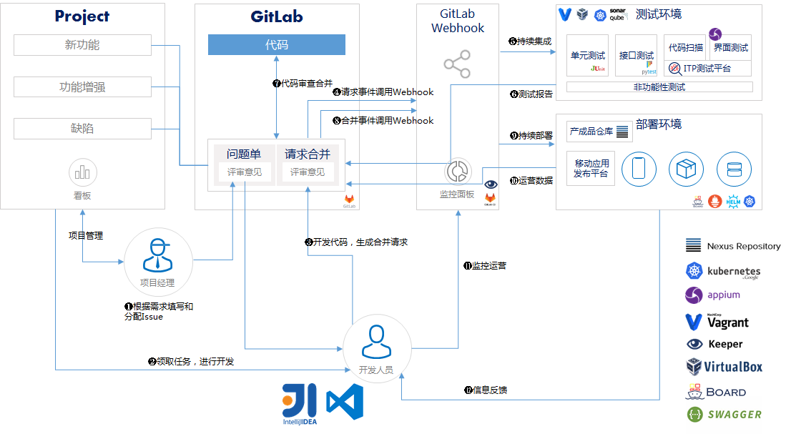
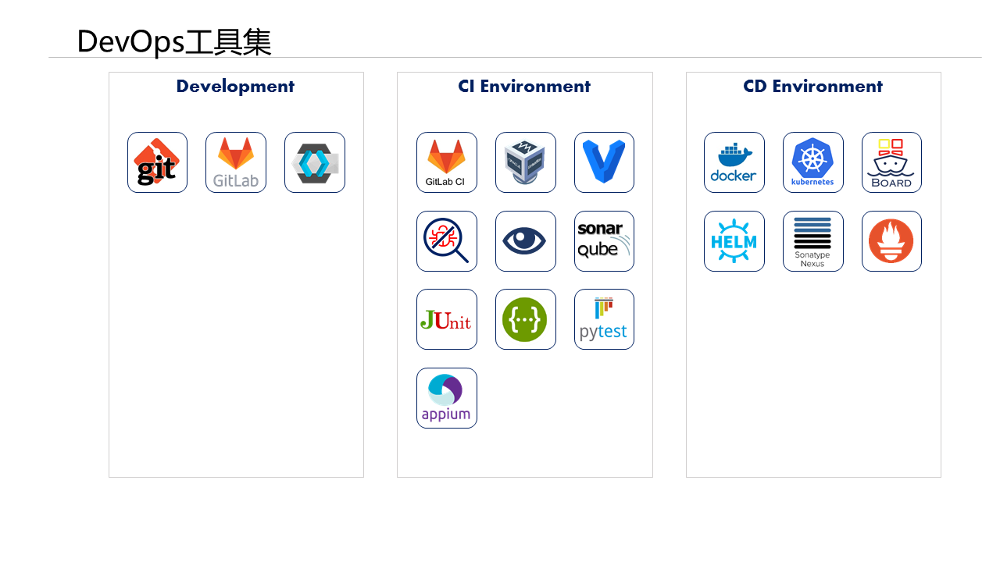

# 背景

近年来，以容器、微服务、DevOps为代表的云原生技术，可以为企业提供更高的敏捷性、弹性和云间的可移植性，促使IT架构从稳态转向敏捷，受到了人们的广泛关注。

DevOps就是为了提高软件研发效率，快速应对变化，持续交付价值的一系列理念和实践，其基本思想就是持续集成持续部署（CICD)，让软件的构建、测试、发布能够更加快捷可靠，以尽量缩短系统变更从提交到最后安全部署到生产系统的时间。要实现持续集成持续部署，就必须对业务进行端到端分析，把所有相关部门的操作统一考虑进行优化，利用所有可用的技术和方法，用一种理念来整合资源。DevOps理念从提出到现在，已经深刻影响了软件开发过程。DevOps提倡打破开发、测试和运维之间的壁垒，利用技术手段实现各个软件开发环节的自动化甚至智能化，被证实对提高软件生产质量、安全，缩短软件发布周期等都有非常明显的促进作用，也推动了IT技术的发展。

通过引入DevOps理念强化软件研发运营全周期的管理，从软件需求到生产运维的全流程改进和优化，结合统一工具链，实现文化、流程、工具的一致性，降低应用软件高频发布带来的风险，降低组织内部的沟通与管理障碍，提升软件产品质量，加速开发流程标准化，应用微服务化,业务的流程化、自动化。松耦合架构会减轻因需求变更导致的系统迭代成本，为多团队并行开发提供基础，并加快交付速度；部署流程标准化，标准容器化的打包方式实现了真正的应用可移植性，不再受限于特定的基础架构环境。

通过CICD编排引擎，建立可视化 Pipeline流水线，打通开发、测试、部署、运维全环节，实现应用的需求管理、代码审查与代码仓库的管理、自动化测试管理、自动部署、应用升级回滚与上线运行和服务治理等功能。持续集成持续交付等工具链提升业务自动化程度，从资源申请、环境准备、测试预发上线到故障修复，一站式解决，且整个过程不再需要大量人力介入，既提升业务整体响应效率，也降低了人力成本；云原生较强的可观察性提升业务稳定性，通过服务状态、系统健康度、接口调用情况、异常的实时告警等实现可视化及预警化，自动化的量化和监控功能，结合业务健康检测启用容器级别的异常自动恢复，及时规避业务风险；应用微服务化改造，规范服务标准、服务治理以及服务问题追踪，将应用程序代码拆分运行在多个进程之中，简化研发运维，并灵活实现按需水平扩展。

# 产品定位

Board-DevOps是一个基于开源项目构建的研发运营一体化DevOps平台，具有项目管理、代码管理、测试管理、质量管理、配置管理、制品仓库、流水线管理的功能。它为企业或开发团队提供了一个使用开源工具集快速搭建DevOps平台的解决方案，并且结合在企业中的最佳实践，提供了一套覆盖软件开发全生命周期的DevOps使用规范，可指导企业以Board-DevOps平台为基础，构建适合自己的DevOps流程，帮助企业或开发团队实现快速的业务应用交付和持续创新。我们希望把DevOps理念与文化引入行业标杆企业，推广云原生应用开发，提高生产效率，促进产业数字化升级。

# 架构图

  

| 组件 | 服务地址 | 简介 | 工具源 |
| ------ | ------ |------ | ------ |
| Gitlab |     | 代码管理和流水线驱动 | https://github.com/ |
| Sonarqube |     | 代码扫描和单元测试平台 | https://www.sonarqube.org |
| Nexus |       | 产成品和镜像仓库 | https://www.nexusmods.com/ |
| Kubernetes |       | 容器调度平台 | https://kubernetes.io/ |
| Keeper |      | 虚机调度及Gitlab回调集成服务平台 | https://github.com/inspursoft/keeper |
| Board |      | 容器云管理平台 | http://github.com/inspursoft/board/ |
| Prometheus |     | 监控管理工具 | https://prometheus.io/ |
| Helm |     | 基于容器的包管理工具 | https://helm.sh/ |
| Vagrant |     | 虚拟机调度平台  | https://www.vagrantup.com/ |
| VirtulBox|     | 虚拟机调度平台  | https://www.virtualbox.org/ |
| ITP |     | 测试及质量管理平台 | http://git.inspur.com/testcenter/testservice-ui |
| appium-service |       | UI测试服务 | http://appium.io/ |
| JUnit |     | 单元测试工具 | https://junit.org/junit5/ |
| Swagger |     | API描述工具 | http://swagger.io/ |
| Pytest |     | API接口测试工具 | https://pypi.org/project/pytest/ |
| vscode 1.37.0|     | 前端 | https://code.visualstudio.com|
| node.js 10.16.2|     | 前端 | http://nodejs.cn/download/|
| gradle 4.9|     | 前端 | https://gradle.org|
| android sdk 26|     | 前端测试 | http://developer.android.com|
| cordova 8.0.0|     | 前端测试 | https://cordova.apache.org|
| intllij 2019.2|     | 服务端 | http://www.jetbrains.com/idea/|
| jdk 9|      | 服务端 | https://www.oracle.com|
|apache-ant|     | 前端 | http://ant.apache.org|

# 主要功能

## 项目管理
DevOps项目管理是为开发团队提供丰富的业务功能，项目协作，任务管理，项目仪表盘，多维度看板等，为开发者提供直观有效的管理 项目进度与质量，加强团队及个人的协调与配合，摒弃分散系统带来的成员和数据的割裂，使团队的协作更紧密，数据反馈更及时，团队表现更优异。
+ 项目协作打破部门边界，市场运营、产品经理和项目拆分为具体的可执行的任务，分工明确，井然有序工程师可以共享同一个工作台。以协作的方式，多样化的工具整合，展现更紧密的跨部门协作，创造更多业务增长。多元视角赋能每一位成员，让企业、团队和个人以更高效的协作方式围绕目标 创造成果。
+ 任务管理将项目拆分为具体的可执行的任务，分工明确，井然有序。帮助每个人准确掌握自己在任务中的职责，更好的做任务管理和展现，高效驱动每一项任务得到落实。
+ 简洁优雅的看板呈现着项目的各个关键阶段，随时看见谁在何时要完成什么，团队成员不必再在协同工作进展上耗费时间。
+ 无缝支持Scrum敏捷方法与DevOps的完整流程，可以围绕产品目标灵活规划每个迭代冲刺。实时数据反馈，让计划调整更及时，团队成员积极应对变化，持续交付价值。

## 代码管理

代码管理为开发人员提供GitLab源代码仓库，支持JAVA、GO、Python、 .Net core、JavaScript等多种开发语言，在DevOps支撑下，实现云原生应用由源代码到镜像或程序包的编译、构建，并支持多种触发方式，使得源代码到生成云上资产的过程高效便捷。

## 测试管理

测试管理为开发者提供单元测试，API自动化测试以及UI自动化测试，从不同维度来提升代码的质量，提高软件开发过程的效率。

## 质量管理

## 配置管理

## 流水线管理

## 制品仓库

# 安装部署

  

# 最佳实践

##
[信通院DevOps能力评估项目](https://github.com/inspursoft/DevOps/tree/master/%E9%A1%B9%E7%9B%AE%E8%83%8C%E6%99%AF)
##
某电力集团的研发一体化平台，实现了业务应用的松耦合、自治、共享、可扩展、可配置等能力。采用 DevOps 实现开发运维一体化，形成闭环，提高应用服务生命周期管理效率；采用 API 管理实现了内外统一的、稳定的、可重用接口层；通过平台云化部署，打通开发、测试、运维通道，实现软件持续开发、持续测试、持续构建，实现了交付效能的显著提升。
